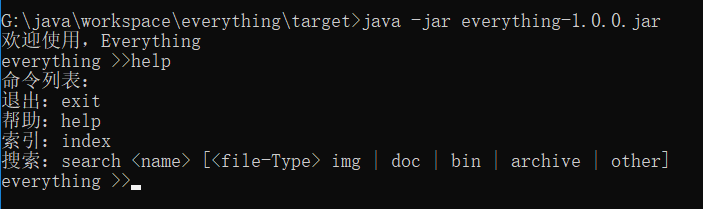
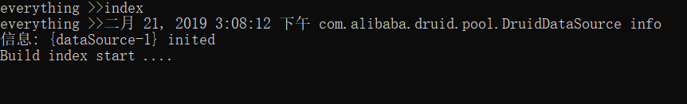
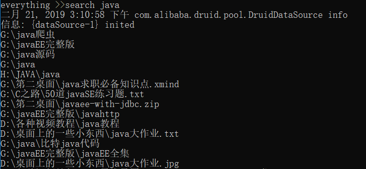

## Everything

### 1. 简介

仿照Everything桌面工具，基于Java语言开发的命令行文件搜索工具

### 2. 背景

有时候在windows命令行下需要查询一些文件，由于`for`命令并不如Linux下的`find`命令好用，所以DIY开发一款命令行工具，用来实现Windows命令行中搜索文件。

### 3. 意义

+ 解决Windows命令行下文件搜索问题
+ 锻炼编码能力

### 4. 功能

+ 文件名检索
+ 文件类型+文件名
+ 最近文件

### 5. 技术

+ Java（文件操作）
+ Database（嵌入式H2数据库）
+ JDBC

###6. 实现

#### 6.1 索引

+ 指定目录建立索引
+ 指定目录排查建立索引（一些不经常搜索的目录，比如：windows系统的目录）

#### 6.2 存储

+ 嵌入式数据库H2（优势是可以随着程序一起发布）

#### 6.3 检索

+ 根据条件检索内容
+ 检索内容后置过滤（由于只监控新增，因此检索后内容如果不存在，做清理操作）

#### 6.3 监控

+ 指定目录的文件新增（考虑整个文件系统做监控，效率太低，只监控自定义的目录）

#### 6.4 交互

+ 参数配置和解析
+ 执行流程

### 7. 用法

#### 7.1 命令

	  

#### 7.2 建立索引

	  

#### 7.3 搜索

	  

